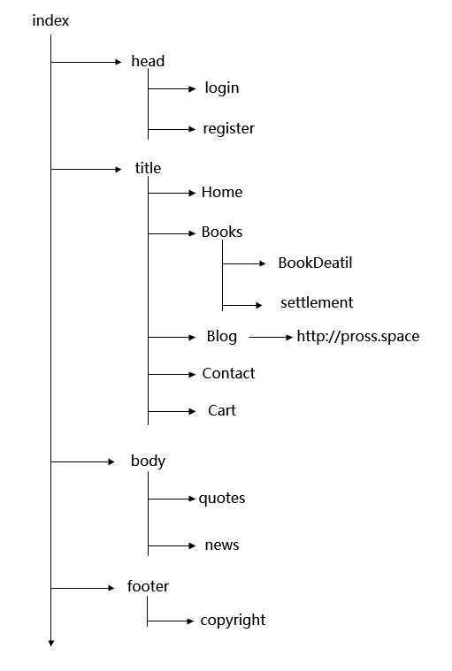

### BookStore 

**网站结构图**：

**已实现的功能**：

 - 登录（session记住用户名，登录校验），注册（进行注册校验）
 - 主页（登入登出，轮播，导航栏），商品页（商品遍历，层级显示）
 - 商品详情页（动态展示，放大镜）
 - 商品添加购物车（没有登录不能添加到购物车）
 - 购物车页面（从cookie中读取信息展示）
 - 确认购物信息，提交到订单系统
 - 订单数据显示管理（数据统计，后台管理）

**项目网站：**

http://120.77.252.0:8085/BookStore/